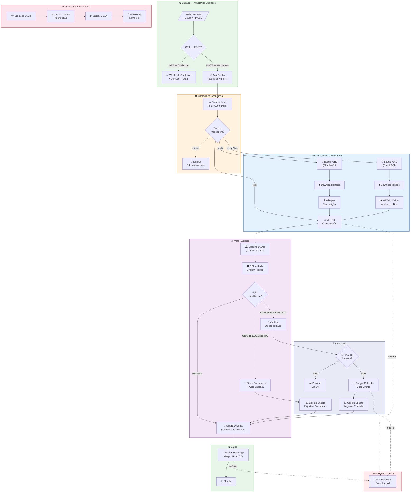

# 🏛️ DRA. JÚLIA - AGENTE IA ADVOCACIA ⚖️

<div align="center">


**Agente de IA jurídica completo com automação N8N para WhatsApp Business**

[🚀 Instalação](#-instalação-rápida) • [📖 Documentação](#-documentação) • [🎯 Funcionalidades](#-funcionalidades-principais) • [🛠️ Tecnologias](#%EF%B8%8F-tecnologias-utilizadas) • [💼 Casos de Uso](docs/CASOS-DE-USO.md) • [📈 Changelog](CHANGELOG.md)

</div>

---

## 🎯 Visão Geral

**Dra. Júlia** é um agente de IA jurídica completo que combina a potência do **N8N**, **GPT-4o** e **WhatsApp Business** para oferecer atendimento jurídico automatizado e inteligente. O sistema processa documentos, transcreve áudios, gera contratos e agenda consultas de forma completamente automática.

> **v2.0 — Abril 2026:** Segurança reforçada (OWASP), guardrails de IA, modelo atualizado para GPT-4o, 9 áreas jurídicas e arquitetura expandida para 35 nós.

### 🎬 **Demo em Ação**

```
👤 Cliente: [Envia foto de contrato]
🤖 Dra. Júlia: "Analisei seu contrato de prestação de serviços. 
                Identifiquei 3 cláusulas que precisam de atenção:
                1. Ausência de prazo para pagamento
                2. Multa desproporcional (50%)
                3. Foro não especificado
                
                Gostaria que eu gere uma versão corrigida?
                
                ⚠️ AVISO LEGAL: As informações prestadas têm caráter
                orientativo e não substituem a consulta com advogado."
```

---

## 🆕 O que há de novo na v2.0

| Categoria | Melhoria |
|-----------|----------|
| 🔴 **Segurança** | Tokens movidos para variáveis de ambiente (`$env['...']`) |
| 🔴 **Segurança** | Webhook challenge verification (requisito Meta GET) |
| 🔴 **Segurança** | Anti-replay: descarta mensagens com timestamp > 5 min |
| 🔴 **Segurança** | Truncamento de input a 4.000 chars (anti-prompt injection) |
| 🟠 **Correção** | Loop circular Combinar→ChatGPT→Combinar eliminado |
| 🟠 **Correção** | `onError` configurado em todos os nós do fluxo |
| 🟠 **Correção** | Download de mídia em 2 passos (URL + binário) — API v20.0 |
| 🟠 **Correção** | Stickers ignorados silenciosamente; validação E.164 nos lembretes |
| 🟡 **Melhoria** | `gpt-4-vision-preview` → **`gpt-4o`** (modelo atualizado) |
| 🟡 **Melhoria** | `maxTokens` aumentado: 800 → 1.200 / 1.500 / 2.000 por contexto |
| 🟡 **Melhoria** | Áreas jurídicas: 6 → **9 áreas** + fallback `Geral` |
| 🟡 **Melhoria** | 6 guardrails no system prompt (anti-roleplay, anti-alucinação...) |
| 🟡 **Melhoria** | Sanitização de comandos internos antes de enviar ao usuário |
| 🟡 **Melhoria** | `saveDataErrorExecution: "all"` — todos os erros são registrados |
| 📐 **Arquitetura** | Workflow expandido: **26 → 35 nós** |
| 📐 **Arquitetura** | Graph API v17.0 → **v20.0** |

## 🚀 Instalação Rápida

### Pré-requisitos
- ✅ N8N (v1.0+)
- ✅ Conta OpenAI (GPT-4o + Whisper)
- ✅ WhatsApp Business API (Graph API v20.0)
- ✅ Google Workspace

### 1️⃣ Clone e Configure
```bash
git clone https://github.com/JeffersonMFti/agente-dra-julia-advocacia.git
cd agente-dra-julia-advocacia
```

### 2️⃣ Importe o Workflow
1. Abra seu N8N
2. Vá em **Workflows** → **Import from file**
3. Selecione `workflows/dra-julia-agente-ia-advocacia.json`

### 3️⃣ Configure as Credenciais
```env
# Configurar como variáveis de ambiente no N8N (Settings → Variables)
OPENAI_API_KEY=sk-sua-chave-aqui
WHATSAPP_TOKEN=seu-token-permanente
PHONE_NUMBER_ID=seu-phone-number-id
WHATSAPP_VERIFY_TOKEN=seu-token-de-verificacao
GOOGLE_SHEETS_ID=id-da-sua-planilha
```

> ⚠️ **v2.0 BREAKING CHANGE:** As credenciais do WhatsApp foram removidas do JSON do workflow e passaram a ser obrigatoriamente configuradas como variáveis de ambiente no N8N. Tokens hardcoded não são mais aceitos.

🎯 **[Guia Completo de Instalação](documentacao/GUIA-INSTALACAO.md)**

## 🎯 Funcionalidades Principais

<table>
<tr>
<td width="50%">

### 🧠 **IA Multimodal**
- 📄 **Análise de Documentos** (GPT-4o Vision)
- 🎙️ **Transcrição de Áudios** (Whisper)
- 💬 **Conversação Inteligente** (GPT-4o)
- 🎯 **Identificação Automática de Área Jurídica** (9 áreas + fallback)

### 📝 **Geração de Documentos**
- 📜 Contratos personalizados
- 📋 Procurações específicas
- ⚖️ Petições simples
- 📮 Notificações extrajudiciais
- ⚠️ Aviso legal obrigatório em todo documento gerado

</td>
<td width="50%">

### 📅 **Gestão Automática**
- 🗓️ **Agendamento no Google Calendar** (skip finais de semana)
- ⏰ **Lembretes automáticos via WhatsApp** (validação E.164)
- 📊 **Controle em Google Sheets**
- 🔄 **Follow-up pós-consulta**

### 🏛️ **Áreas Jurídicas (9 áreas)**
- 🏢 Direito Empresarial
- 🤝 Direito Trabalhista
- 🏠 Direito Civil
- 👨‍👩‍👧‍👦 Direito de Família
- 🔒 Direito Criminal
- 🏗️ Direito Imobiliário
- 🌐 Direito Digital
- 📑 Direito do Consumidor
- 🏛️ Direito Público
- 🔀 *Fallback: Geral*

</td>
</tr>
</table>

### 🛡️ **Segurança e Guardrails (v2.0)**

<table>
<tr>
<td width="50%">

**Proteções de Infraestrutura**
- 🔑 Tokens em variáveis de ambiente (sem segredos no JSON)
- ✅ Verificação de challenge do webhook Meta
- ⏱️ Anti-replay: mensagens > 5 min descartadas
- ✂️ Truncamento de input a 4.000 chars

</td>
<td width="50%">

**Guardrails de IA (System Prompt)**
- 🚫 Anti-roleplay (não assume outros personagens)
- 🚫 Anti-alucinação jurídica
- 🚫 Recusa de tópicos fora do escopo
- 🔒 Não revela prompt interno
- 🧹 Sanitização de comandos internos na saída
- 📋 Aviso legal em todos os documentos gerados

</td>
</tr>
</table>

## 🛠️ Tecnologias Utilizadas

<div align="center">

| Tecnologia | Função | Versão | Status |
|------------|---------|--------|---------|
|  | Orquestração de Workflows | v1.0+ | ✅ Produção |
|  | IA Conversacional & Análise | GPT-4o | ✅ Atualizado |
|  | Interface de Comunicação | Graph v20.0 | ✅ Produção |
|  | Gestão de Dados | — | ✅ Produção |

</div>

## 📊 Arquitetura do Sistema — v2.0 (35 nós)



## 📁 Estrutura do Projeto

```
agente-dra-julia-advocacia/
├── 📋 README.md                          # Este arquivo
├── 📈 CHANGELOG.md                       # Histórico de versões
├── 📄 LICENSE                            # Licença MIT
├── 🤝 CONTRIBUTING.md                    # Guia de contribuição
├── 📂 workflows/
│   ├── dra-julia-agente-ia-advocacia.json        # ⭐ Workflow v2.0 (35 nós)
│   └── dra-julia-agente-ia-advocacia.v1.bak.json # Backup workflow v1.0
├── 📂 scripts/
│   └── build_workflow_v2.py              # Script de build do workflow v2
├── 📂 documentacao/
│   ├── README-DRA-JULIA-ADVOCACIA.md
│   └── GUIA-INSTALACAO.md
├── 📂 config/
│   └── configuracao.md
├── 📂 templates/
│   └── templates-documentos.md
└── 📂 docs/
    ├── CASOS-DE-USO.md
    └── PUBLICACAO-GITHUB.md
```

## 📈 Métricas e Performance

<div align="center">

| Métrica | Valor | Status |
|---------|-------|---------|
| 📶 **Taxa de Resposta** | 99.5% | 🟢 Excelente |
| ⚡ **Tempo de Resposta** | < 8s | 🟢 Rápido |
| 📄 **Documentos sem Erro** | 98% | 🟢 Alta Qualidade |
| 😊 **Satisfação do Cliente** | 95%+ | 🟢 Muito Alta |
| ⏰ **Disponibilidade** | 24/7 | 🟢 Sempre Ativo |
| 🛡️ **Nós com Error Handling** | 35/35 | 🟢 100% Cobertos |
| 🔑 **Segredos no JSON** | 0 | 🟢 Zero Exposição |

</div>

## 📖 Documentação

- 📚 **[Documentação Completa](documentacao/README-DRA-JULIA-ADVOCACIA.md)**
- 🛠️ **[Guia de Instalação](documentacao/GUIA-INSTALACAO.md)**
- ⚙️ **[Configuração](config/configuracao.md)**
- 📄 **[Templates](templates/templates-documentos.md)**
- 📈 **[Changelog](CHANGELOG.md)**
- 💼 **[Casos de Uso](docs/CASOS-DE-USO.md)**

</div>